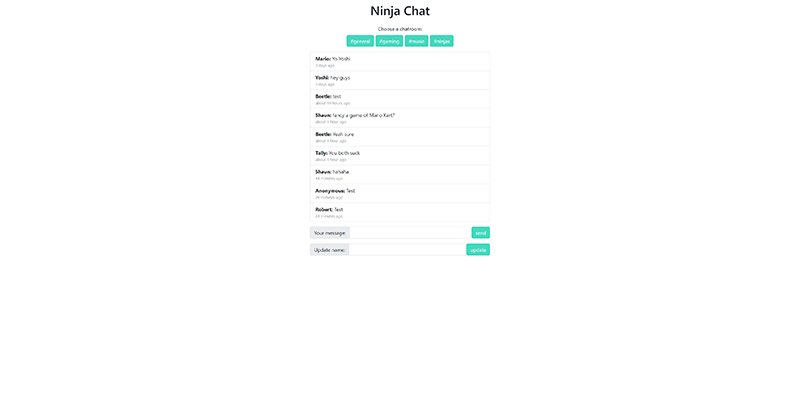

# Ninja Chat - Javascript Course Project

This is a small chat application coded for a javascript course. 

## Table of contents

- [Overview](#overview)
  - [The challenge](#the-challenge)
  - [Screenshot](#screenshot)
  - [Links](#links)
- [My process](#my-process)
  - [Built with](#built-with)
  - [What I learned](#what-i-learned)
  - [Continued development](#continued-development)
  - [Useful resources](#useful-resources)
- [Author](#author)
- [Acknowledgments](#acknowledgments)

### The challenge

Users should be able to:

- Choose a chat room
- Type chat messages to each other
- Change their username

### Screenshot

### Links

- Live Site URL: [GitHub](https://robertwalker68501.github.io/ninja-chat/)

## My process

### Built with

- Semantic HTML5 markup
- CSS custom properties

## Author

- Facebook - [Facebook](https://www.facebook.com/robertwalker6580)
- Twitter - [@RobertW15135868](https://www.twitter.com/RobertW15135868)